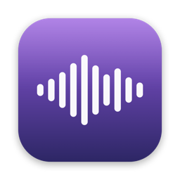
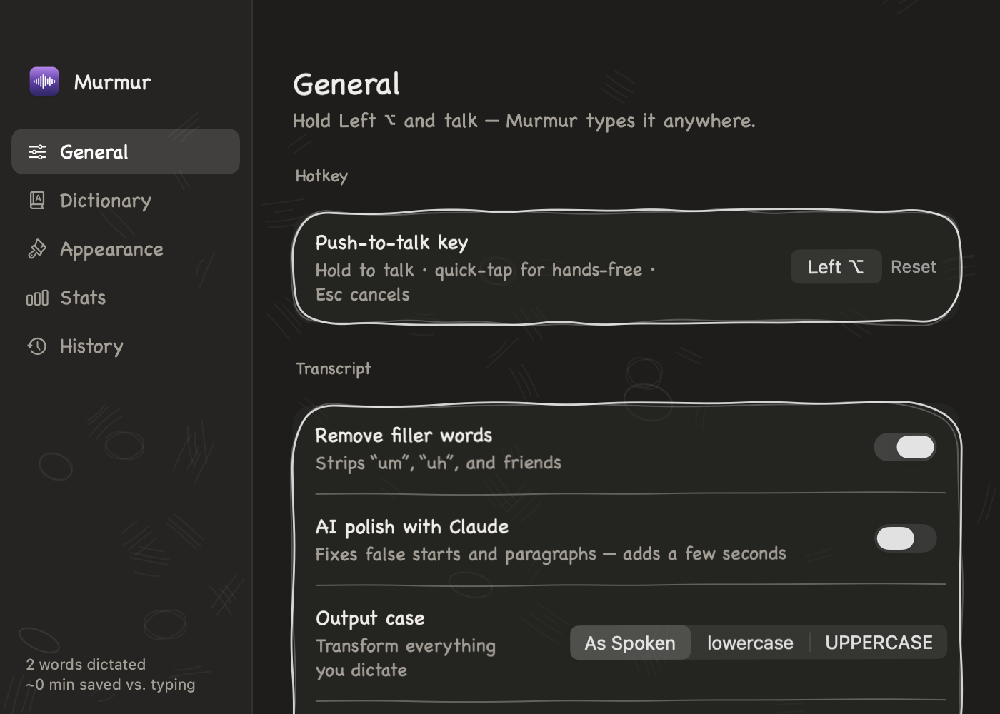
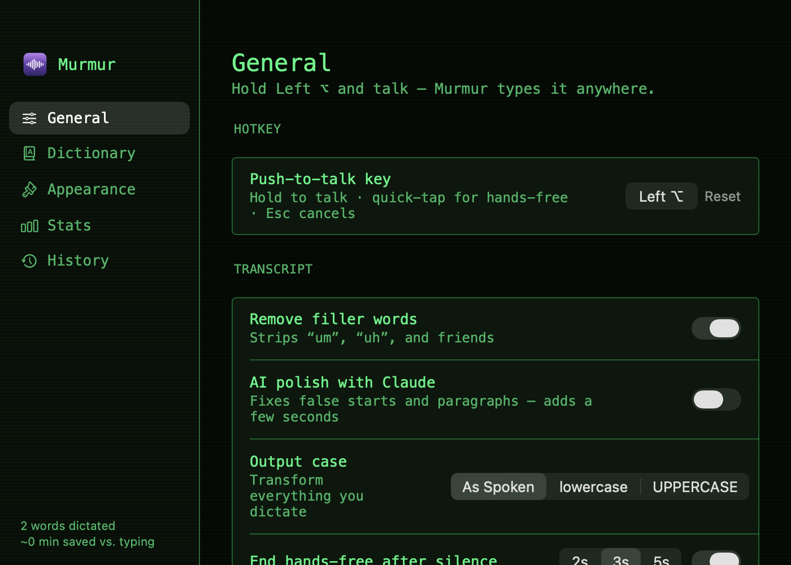

<p align="center">
  
</p>

<h1 align="center">Murmur</h1>

<p align="center">
  Hold a key. Talk. It types — into any app on your Mac.<br>
  <b>100% on-device, private, and free.</b> No account, no subscription, no cloud.
</p>

---

Murmur is a menu-bar dictation app for macOS in the spirit of Wispr Flow, built
on Apple's on-device speech recognition. Hold your push-to-talk key, speak, and
the transcript is typed into whatever app you're using — with live preview,
cleanup, and a lot of toys.



## Features

**Dictation**
- Hold-to-talk on any key you choose (modifiers, F-keys, anything) — quick-tap
  for hands-free, Esc cancels, auto-stop after silence
- Floating pill with live transcript, waveform, word count, recording timer,
  and the name of the app you're dictating into
- On-device recognition in 15+ languages, with auto-punctuation
- Filler-word removal ("um", "uh"), output case transforms
- Voice commands: "new line", "new paragraph", "bullet point",
  "fire emoji" 🔥, "shrug emoji" ¯\\\_(ツ)\_/¯, and friends
- Optional AI polish via the [Claude CLI](https://claude.com/claude-code)
  with Clean / Email / Casual / Custom tones

**Dictionary**
- Spoken phrase → typed text replacements (snippets, names, jargon)
- Phrases are fed to the recognizer as vocabulary hints, so unusual words
  actually get recognized

**Insertion**
- Clipboard-swap + ⌘V by default (your clipboard is restored)
- Type-it-out mode for terminals and apps that block paste
- Clipboard-only mode, insert-from-history, snippet menu

**Looks**
- Six skins that restyle the whole app *and* the pill: Clean, Sketch
  (hand-drawn, chalkboard in dark mode), Terminal, Blueprint, Retro Mac, Neon
- Free-form accent color wheel, pill size/position/opacity, wave styles,
  light/dark support




**Stats**
- Words, sessions, streaks, minutes saved vs. typing, 7-day activity chart,
  daily word goal, and 20 unlockable achievements

## Install

Grab the DMG from [Releases](../../releases), drag Murmur to Applications, and
launch. The welcome window walks you through the three permissions it needs:

| Permission | Why |
|---|---|
| Microphone | hear you while the key is held |
| Speech Recognition | transcribe on-device |
| Accessibility | type the result into the active app |

Nothing you say ever leaves your Mac. The optional AI-polish feature shells
out to your local `claude` CLI only if you turn it on.

## Build from source

Requires Xcode command-line tools (Swift 5, macOS 14+).

```sh
./build.sh          # compiles, signs, installs to /Applications, launches
./build.sh --no-run # build only
./make_dmg.sh       # package a distributable DMG into dist/
```

`build.sh` signs with your Apple Development certificate when one exists in
the keychain (so macOS permissions survive rebuilds) and falls back to ad-hoc
signing otherwise.

`main.swift` is a development harness — it renders every window to PNGs and
runs the text-pipeline smoke tests without launching the app:

```sh
xcrun swiftc -target arm64-apple-macos14.0 Theme.swift Settings.swift \
  Onboarding.swift PillPanel.swift HotkeyManager.swift TextCleaner.swift \
  Inserter.swift main.swift -o preview && ./preview
```

## License

[MIT](LICENSE)
